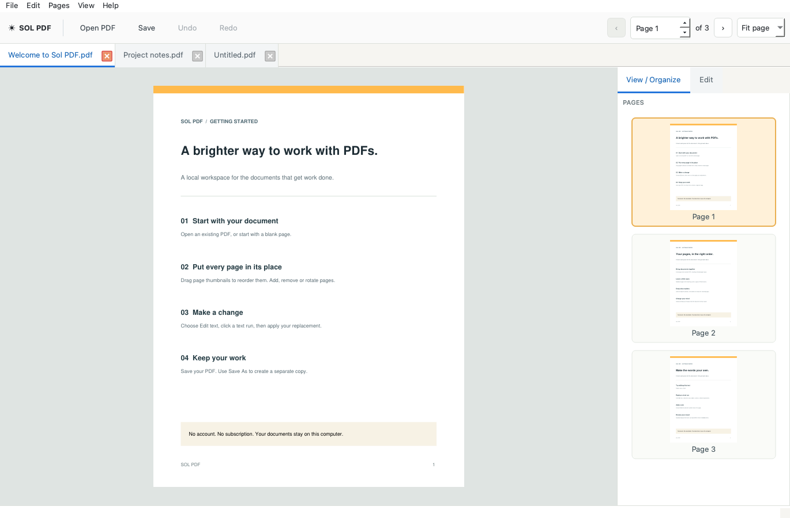

# Sol PDF

A local desktop PDF editor for Windows on Intel/AMD 64-bit PCs, Apple Silicon Macs, and Linux x64. No account, cloud upload, subscription, or paid runtime service.

## Download

Get the application from the [latest release](https://github.com/Airbornz/SolPDF/releases/latest):

| Platform | Download | Open after extracting |
| --- | --- | --- |
| Windows, Intel/AMD 64-bit | [Windows ZIP](https://github.com/Airbornz/SolPDF/releases/latest/download/Sol-PDF-Windows-x64.zip) | `Sol PDF.exe` |
| Mac, Apple Silicon (M-series) | [Mac ZIP](https://github.com/Airbornz/SolPDF/releases/latest/download/Sol-PDF-macOS-arm64.zip) | `Sol PDF.app` |
| Linux, Intel/AMD 64-bit | [Linux archive](https://github.com/Airbornz/SolPDF/releases/latest/download/Sol-PDF-Linux-x64.tar.gz) | `Sol PDF` |

Keep the extracted application and its adjacent folders together. No Python installation is required. On Mac, the app is not notarized; you may need to approve it in System Settings → Privacy & Security. Linux desktop libraries are listed below.



## What you can do

- Open a PDF or create a blank document.
- Open multiple PDFs in document tabs; each keeps its own edits, undo/redo, page position, zoom, Find, and text draft. Open several files together or drop them onto the window. Reopening an already open file selects its tab.
- Drag page thumbnails to reorder; select multiple pages with Ctrl on Windows/Linux or Command on Mac.
- Insert all or selected pages from another PDF, using ranges such as `1, 3-5`.
- Add blank pages with matching dimensions, US Letter, A4, or Legal sizes.
- Resize the current page to Letter, A4, Legal, or custom dimensions in inches, millimeters, or points. Fit content proportionally or retain its original size. Crop margins from the visible page.
- Right-click a thumbnail in **View / Organize** to delete, duplicate, or extract pages. The **Rotate** submenu offers 90° clockwise, 180°, 90° counterclockwise, and horizontal or vertical flips. Right-clicking an already selected page keeps the multiselection.
- Replace or remove horizontal selectable text runs; add new text with font, size, and color controls.
- Find text, zoom, undo/redo, Save, and Save As.
- Unlock password-protected PDFs with a password that grants modification permission, then save an unlocked copy. The encrypted original is protected from overwrite.

## Try the Mac build

The locally built app is in `dist/Sol PDF.app`. Double-click it, then choose **Open PDF** or **Start with a blank page**. The ZIP in `dist` can be copied to another Apple Silicon Mac. Requires macOS 12 or later. The app is locally ad-hoc signed, without an Apple Developer certificate or notarization; a downloaded copy may require **Open** from Finder's context menu or approval in System Settings → Privacy & Security.

PDFs open in document tabs, with page navigation and zoom in the main toolbar. Click a tab to switch PDFs, its close button to close that document, or use **Ctrl+Tab** / **Ctrl+Shift+Tab** to cycle documents. **Ctrl+W** (Command+W on Mac) closes the current PDF. Closing a document asks about its unsaved changes; quitting checks every open document. New PDFs get separate tabs with distinct untitled names. File → Open PDF allows selecting several files at once.

Within each PDF, **View / Organize** shows page thumbnails on the right. Drag to reorder or right-click a thumbnail for page actions, including **Resize page** and **Crop page**. Right-click empty space in the page panel for **Add blank page** or **Insert PDF**; they insert after the current page. The **Edit** workspace tab replaces those thumbnails with formatting controls and shows a separate editing toolbar. Floating Find works in both workspaces. Both opened PDFs and new blank documents start in View / Organize.

If you collapse the right sidebar by dragging its divider to the edge, click the arrow at the right edge to restore it at its previous width. **View → Show right sidebar** also reopens it.

**Ctrl+F** on Windows/Linux or **Cmd+F** on Mac opens a small floating Find panel. Results update as you type; Enter moves forward and Shift+Enter moves backward. Use Escape or the close button to dismiss it. The panel overlays the PDF without changing the document area.

In **Edit**, select **Edit text**, click a highlighted run, change it in the right panel, then click **Apply text**. Format with font, size, color, bold, and italic controls; change X/Y to reposition the text. Replacements can use available space up to neighboring text or the page edge. If a replacement is too wide, shorten it or lower its font size. An empty replacement deletes the selected text. **Show text outlines** controls the editing guides.

**Add text** lets you click directly on the PDF and type on the page. The live preview uses the PDF rendering engine and updates with font, size, color, line spacing, and alignment changes from the right panel. Enter adds another line. Click another page location to reposition the draft, or change X/Y. Click the on-page **Apply** button or press **Ctrl+Enter** (**Command+Enter** on Mac) to insert it. **Cancel** or Escape discards it. The draft follows zoom, page rotation, and document-tab switching without changing the PDF until applied. If text exceeds the page bounds, adjust its position, wording, or size before applying.

**Add image** inserts a PNG or JPEG at a chosen position and width, preserving its proportions. **Crop page** removes chosen margins from the visible page area, with undo available. Cropping changes the visible page boundary; it does not delete hidden content.

**Resize page** changes the current page's physical dimensions. Choose a standard paper size and orientation or enter custom width and height. **Scale content to fit** keeps proportions and centers the content; turn it off to keep content at its original size and top-left position (a smaller page may hide content). Resize preserves selectable text, graphics, images, hyperlinks, and page rotation. Both resize and crop support undo/redo and are also available from the **Pages** menu. Resizing pages with annotations or form fields is not supported yet.

## Run from source

Install Python 3.10 or newer (3.12 recommended), then from this folder:

```sh
python -m venv .venv
```

Activate it on Windows:

```powershell
.venv\Scripts\Activate.ps1
```

Or on Mac/Linux:

```sh
source .venv/bin/activate
```

Then:

```sh
python -m pip install -e ".[dev]"
python -m sol_pdf
```

You can also pass a PDF path: `python -m sol_pdf "document.pdf"`.

## Build a standalone app

```sh
python scripts/build.py
```

Build on each destination OS. PyInstaller does not cross-compile. The GitHub Actions workflow builds Windows x64 ZIP, macOS arm64 app ZIP, and Linux x64 tar.gz archives when run manually or on a version tag. Extract the Windows ZIP and open `Sol PDF.exe` inside the folder. Extract the Linux archive and run the `Sol PDF` executable with all adjacent files present.

Linux desktop dependencies (Ubuntu 22.04 or newer):

```sh
sudo apt-get install libegl1 libopengl0 libxcb-cursor0 libxkbcommon-x11-0
```

This project has been tested locally on Apple Silicon. A portable Windows package is also assembled in `dist/Sol-PDF-Windows-x64-portable.zip`: extract the whole ZIP and double-click **Launch Sol PDF.cmd**. It includes official Windows Python and library binaries, so no Python installation is required. This package has not been executed on Windows yet. Build and run the native workflow for Windows validation and a conventional EXE. Linux builds require the workflow or a Linux host and have not been executed here. Installers, automatic updates, Windows code signing, and Apple notarization are not configured.

To recreate the Windows portable archive from another platform, run `python scripts/build_windows_portable.py`. It downloads official Windows wheels and the Python 3.13.16 embedded runtime, verifies the runtime checksum against Python's release page, and packages them with the app source.

## Current limits

This is a working first version, not an Acrobat replacement for every workflow. Scans need OCR, which is not included. Text replacement works on horizontal text runs without paragraph reflow. It uses standard sans, serif, or mono fonts rather than the original embedded font. Unicode characters use a built-in fallback font where available; complex scripts, emoji, angled text, and exact font matching are not guaranteed. The original text is removed using a narrow redaction region; images and vector backgrounds are retained. Review changes in dense or overlapping layouts. Existing unapplied redactions must be handled elsewhere before replacing text.

Flips mirror the visible page while preserving selectable text, images, and vector graphics. Flip it back before editing mirrored text. Pages with annotations or form fields cannot be mirrored in this version; hyperlinks are supported.

Forms, digital-signature preservation, annotations, OCR, and PDF/A validation are outside this version. Editing a signed PDF invalidates its signature. Use Save As when retaining the original matters. Normal saves use a temporary file, verify the output page count, then replace the destination. Undo history is held in memory (up to 30 changes, trimmed toward a 128 MB budget), and is not retained after closing. Very large PDFs may need substantial memory; thumbnail generation is batched, but opening and edits run on the UI thread.

## Verification

```sh
python -m pytest -q
```

The tests exercise page operations, actual text removal, preservation of nearby content, Unicode insertion, rotated page selection, undo/redo, password handling, output reopening, and failure-safe writes. Desktop tests use Qt's offscreen mode.

## License

Sol PDF is open-source under **AGPL-3.0-or-later**, matching the open-source PyMuPDF engine. See `LICENSE` and `THIRD_PARTY_NOTICES.md`. There is no paid runtime dependency in this build. A proprietary distribution would need a different licensing arrangement for the PDF engine.
